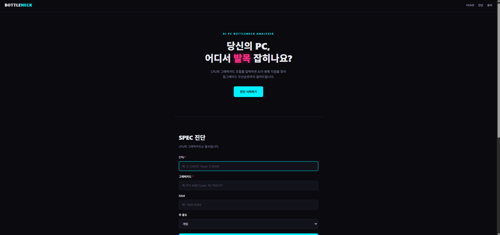
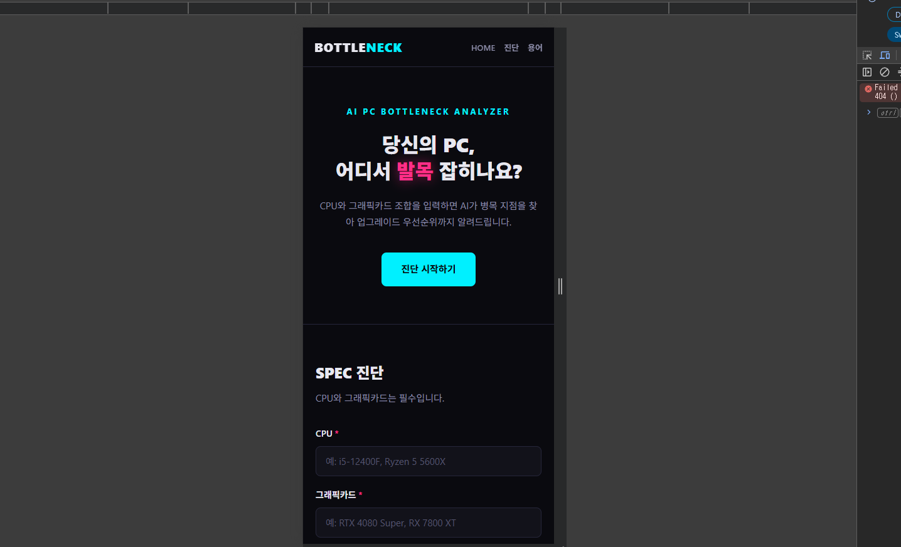
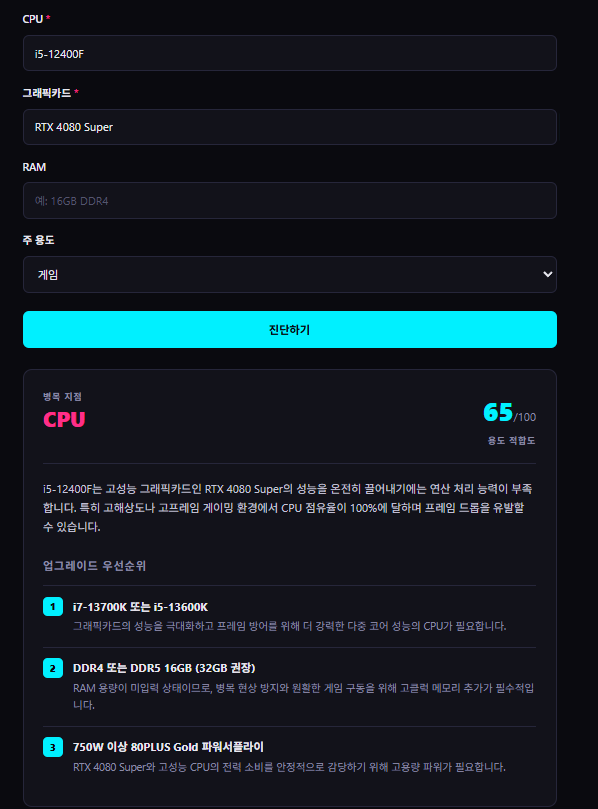
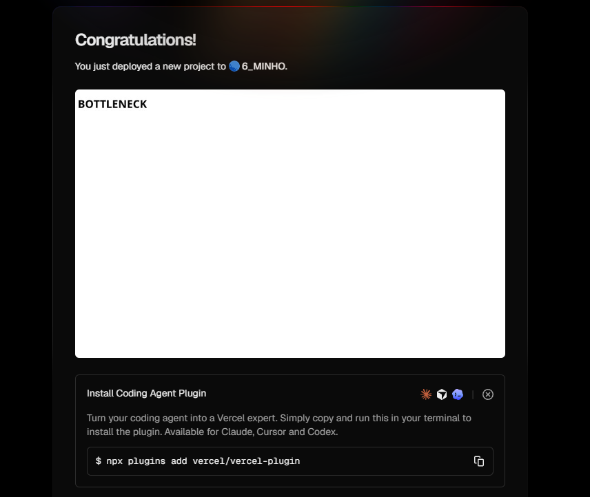
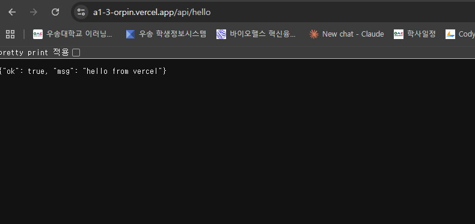

# BOTTLENECK

> CPU와 그래픽카드 조합의 병목 지점을 AI가 진단하는 웹 서비스

**배포 URL:** https://a1-3-orpin.vercel.app

---

## 서비스 소개

고성능 그래픽카드를 샀는데 CPU가 따라가지 못하면 그래픽카드는 제 성능을 내지 못합니다.
이를 병목(bottleneck) 현상이라 하는데, PC 입문자는 자신의 조합에 병목이 있는지 판단하기 어렵습니다.

BOTTLENECK은 사양을 자유 텍스트로 입력받아 AI가 병목 부품을 지목하고,
판정 근거와 업그레이드 우선순위 3가지를 함께 제시합니다.

### 주요 기능

- **AI 병목 진단** — CPU·그래픽카드·RAM·용도를 입력하면 병목 부품, 적합도 점수(0~100), 판정 이유, 업그레이드 우선순위를 반환
- **용어 사전** — 병목 현상, TDP, PCIe 레인, 프레임 드랍 설명
- **반응형 레이아웃** — 모바일·태블릿·데스크톱 대응

---

## 화면

### 데스크톱 / 모바일

| 데스크톱 | 모바일 |
| --- | --- |
|  |  |

### AI 진단 기능



CPU·그래픽카드·용도를 입력하면 병목 부품, 적합도 점수, 판정 이유, 업그레이드 우선순위가 출력됩니다.

---

## 기술 스택

| 구분 | 사용 기술 |
| --- | --- |
| 프론트엔드 | HTML, CSS, JavaScript (바닐라) |
| 백엔드 | Vercel Serverless Functions (Python) |
| AI | Google Gemini API (`gemini-3.5-flash-lite`) |
| 배포 | Vercel (GitHub 연동 자동 배포) |

---

## 프로젝트 구조

```
A1-3/
├── index.html              # 단일 페이지 (3개 섹션)
├── css/
│   └── style.css           # 사이버펑크 테마 + 반응형
├── js/
│   └── main.js             # fetch 연동, 실패 처리
├── api/
│   ├── hello.py            # 배포 검증용 엔드포인트
│   └── diagnose.py         # Gemini API 연동 진단 엔드포인트
├── images/                 # 서비스 스크린샷
├── docs/
│   ├── planning.md         # 서비스 기획서
│   └── ai-log.md           # AI 코딩 도구 사용 로그
├── requirements.txt
└── README.md
```

---

## 동작 구조

```
[브라우저]                    [Vercel]                  [Google]
   │                            │                          │
   │  1. 사양 입력                │                          │
   │  2. fetch POST              │                          │
   │  /api/diagnose  ──────────► │                          │
   │                            │  3. 환경변수에서 키 로드     │
   │                            │  4. Gemini 호출 ────────► │
   │                            │                          │
   │                            │  ◄──────── 5. JSON 응답    │
   │  ◄──────── 6. 파싱된 결과    │                          │
   │  7. 카드 렌더링              │                          │
```

API 키는 4번 단계에서만 사용되며 브라우저로 전달되지 않습니다.

---

## API

### `POST /api/diagnose`

**요청**

```json
{
  "cpu": "i5-12400F",
  "gpu": "RTX 4080 Super",
  "ram": "16GB DDR4",
  "usage": "게임"
}
```

`cpu`, `gpu`는 필수입니다.

**응답 (200)**

```json
{
  "bottleneck": "CPU",
  "reason": "i5-12400F는 고성능 그래픽카드인 RTX 4080 Super의 성능을 온전히 끌어내기에는 연산 처리 능력이 부족합니다. ...",
  "score": 65,
  "upgrades": [
    { "part": "i7-13700K 또는 i5-13600K", "why": "그래픽카드의 성능을 극대화하기 위해서입니다." }
  ]
}
```

**오류 응답**

| 상태 | 상황 | 응답 |
| --- | --- | --- |
| 400 | 필수값 누락 | `{"error": "CPU와 그래픽카드는 필수 입력값입니다."}` |
| 429 | API 요청 한도 초과 | `{"error": "요청이 많습니다. 잠시 후 다시 시도해주세요."}` |
| 502 | AI 서버 오류 / 응답 파싱 실패 | `{"error": "AI 서버 오류가 발생했습니다. ..."}` |
| 504 | 응답 지연 | `{"error": "AI 응답이 지연되고 있습니다. ..."}` |

---

## 환경 변수 설정

이 프로젝트는 Gemini API 키가 필요합니다.
**키는 저장소에 포함되어 있지 않으므로 직접 발급받아 등록해야 합니다.**

### 1. API 키 발급

1. [Google AI Studio](https://aistudio.google.com) 접속
2. **Get API key** → **Create API key**
3. 생성된 키 복사 (`AIza`로 시작)

### 2. Vercel에 등록

1. Vercel 프로젝트 → **Settings** → **Environments** → **Production**
2. 아래 값 입력 후 저장

   | Key | Value |
   | --- | --- |
   | `GEMINI_API_KEY` | 발급받은 키 |

3. 환경 변수는 **다음 배포부터 적용**되므로, 등록 후 재배포가 필요합니다.

> 키를 코드나 `.env` 파일에 직접 작성하지 마세요.
> `.gitignore`에 `.env`, `.env.local`, `.vercel`이 등록되어 있습니다.

---

## 실행 방법

### 배포 (Vercel)

```bash
git clone https://github.com/6minho/A1-3.git
```

1. [Vercel](https://vercel.com)에 GitHub 계정으로 로그인
2. **Add New → Project** → 저장소 Import
3. 설정은 기본값 유지 (Framework Preset: `Other`, Root Directory: `./`)
4. 환경 변수 `GEMINI_API_KEY` 등록
5. **Deploy**

이후 `main` 브랜치에 push하면 자동으로 재배포됩니다.

### 로컬 확인

프론트엔드만 확인하려면 `index.html`을 브라우저로 열거나 VS Code Live Server를 사용합니다.
단, `/api/diagnose` 호출은 Vercel 환경에서만 동작하므로 AI 기능은 배포 URL에서 테스트해야 합니다.

Serverless Functions까지 로컬에서 실행하려면 Vercel CLI가 필요합니다.

```bash
npm i -g vercel
vercel dev
```

이 경우 프로젝트 루트에 `.env.local` 파일을 만들고 키를 넣습니다.
**공용 PC에서는 이 방식을 권장하지 않습니다.**

```
GEMINI_API_KEY=발급받은키
```

---

## 배포 검증

| 확인 항목 | 방법 |
| --- | --- |
| 정적 페이지 | 배포 URL 접속 |
| Serverless Function | `배포URL/api/hello` → JSON 응답 확인 |
| AI 기능 | 진단 섹션에서 CPU·그래픽카드 입력 후 진단하기 |
| 반응형 | 개발자 도구(F12) → 기기 툴바(Ctrl+Shift+M) |

### 배포 확인 화면

| Vercel 배포 성공 | Serverless Function 응답 |
| --- | --- |
|  |  |

---

## 문서

| 문서 | 내용 |
| --- | --- |
| [서비스 기획서](docs/planning.md) | 기획 배경, 타겟, 페이지 구성, AI 기능 설계, 실패 처리 기준 |
| [AI 코딩 도구 사용 로그](docs/ai-log.md) | 프롬프트 이력, 발생한 오류와 해결 과정 |

---

## 참고

진단 결과는 AI가 생성한 추정치이며 실제 벤치마크 수치와 다를 수 있습니다.
Gemini 무료 티어를 사용하므로 요청이 몰리면 일시적으로 429 응답이 반환될 수 있습니다.
