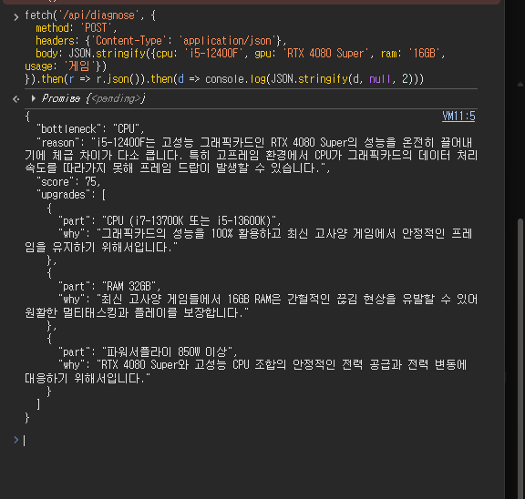

# AI 코딩 도구 사용 로그

- **사용 도구:** Claude (claude.ai)
- **작업일:** 2026-08-12
- **작업 환경:** Windows, VS Code, Git 2.55.0, 공용 PC
- **기록 원칙:** 실제 발생한 요청과 결과만 기록한다. 시도하지 않은 내용은 포함하지 않는다.

---

## 1. 기획 단계

### 요청

> 이 프로젝트를 진행해야 해. 어떻게 시작하는 게 좋을까?
> (과제 명세서 첨부)

### 결과

AI가 제시한 진행 순서 중 **"Hello World부터 배포하라"** 는 조언을 채택했다.
기능을 다 만든 뒤 배포하면 마지막에 배포 문제로 시간을 쓰게 되므로,
빈 페이지와 엔드포인트 하나만으로 GitHub → Vercel 파이프라인을 먼저 검증하는 방식이다.


`/api/hello`가 JSON을 반환하는 것을 확인한 시점에서
"프론트엔드 → Python Serverless Function" 경로가 살아있음이 검증됐다.

실제로 이 순서 덕분에 이후 AI 연동 단계에서 오류가 났을 때
**"배포 문제인가, 코드 문제인가"** 를 고민할 필요가 없었다.

### 아이디어 선정

AI에게 관심사 기반 후보를 요청해 3가지를 받았고, PC 견적 진단기를 선택했다.
직접 PC를 조립하며 겪은 경험이 있어 결과의 타당성을 스스로 검증할 수 있다는 점이 선택 이유였다.

---

## 2. AI API 선택

### 요청

> AI 기능은 어느 API로 할 계획이세요? → 미정 / 추천해주세요

### 결과

Gemini를 선택했다. 신용카드 등록 없이 무료 티어를 사용할 수 있다는 점이 결정적이었다.
OpenAI와 Claude API는 선결제 크레딧이 필요하다.

AI가 함께 지적한 내용 중 실제로 도움이 된 것:

- 무료 티어 입력은 모델 개선에 사용될 수 있으므로 **민감정보를 입력받는 기획은 피할 것**
- 요청 한도 초과 시 429가 반환되므로 **"API 오류 실패 처리"를 실제로 재현해 캡처할 수 있음**

두 번째 지적은 이후 실제로 429를 만났을 때 증빙 자료로 활용했다.

---

## 3. 발생한 오류와 해결 과정

AI가 생성한 코드가 한 번에 동작하지 않았고, 총 4단계의 디버깅을 거쳤다.

### 3-1. 404 — 지원 종료된 모델

**증상**

```json
{ "error": "AI 서버 오류가 발생했습니다. (코드 404)" }
```

**원인 파악 과정**

1. 모델 이름 오타를 의심해 모델 목록 API를 직접 조회했다.

   ```
   https://generativelanguage.googleapis.com/v1beta/models?key=...
   ```

   `gemini-2.5-flash`가 목록에 존재하고 `generateContent`도 지원한다고 나왔다.

2. URL 조립 문제(f-string 누락)를 의심해 URL을 문자열 리터럴로 고정했으나 동일했다.

3. 에러 응답 원문을 임시로 반환하도록 코드를 수정해 전문을 확인했다.

   ```
   "This model models/gemini-2.5-flash is no longer available to new users."
   ```

**원인**

모델 목록 API에는 표시되지만 **신규 사용자에게는 호출이 차단된 모델**이었다.
목록에 있다고 사용 가능한 것은 아니라는 점을 확인했다.

**해결**

`gemini-3.5-flash`로 교체.

**배운 점**

에러 코드만 보고 추측하면 시간이 오래 걸린다.
응답 원문을 확인할 수 있는 경로를 먼저 확보하는 것이 빠르다.

---

### 3-2. 응답 파싱 실패

**증상**

```json
{ "error": "AI 응답을 해석하지 못했습니다. 다시 시도해주세요." }
```

**원인**

`gemini-3.5-flash`는 thinking 모델이라 응답의 `parts` 배열에
사고 과정 블록이 먼저 오고 실제 답변이 뒤에 올 수 있다.
기존 코드는 `parts[0]`만 꺼내 파싱을 시도했다.

**해결**

`parts` 전체를 순회하며 `thought` 플래그가 없는 블록의 텍스트만 이어붙이도록 변경했다.

```python
parts = data['candidates'][0]['content']['parts']
text = ''.join(p.get('text', '') for p in parts if not p.get('thought'))
```

동시에 `thinkingConfig: {"thinkingBudget": 0}`을 추가해 사고 과정 생성 자체를 비활성화했다.

---

### 3-3. 429 — 무료 티어 요청 한도

**증상**

```json
{ "error": "요청이 많습니다. 잠시 후 다시 시도해주세요." }
```

**판단**

오류이지만 **코드가 정상 동작한다는 증거**이기도 했다.
함수가 크래시 없이 실행됐고, Gemini까지 요청이 도달했으며,
429를 감지해 의도한 한국어 안내 메시지를 반환했기 때문이다.

실제 운영 중 발생할 수 있는 API 오류가 설계대로 처리되는 것을 확인한 사례다.

**해결**

한도가 더 여유로운 `gemini-3.5-flash-lite`로 교체했다.
병목 진단은 긴 추론이 필요한 작업이 아니어서 경량 모델로도 결과 품질에 차이가 없었다.

---

### 3-4. 400 — 미지원 옵션

**증상**

```json
{
  "error": {
    "code": 400,
    "message": "Request contains an invalid argument.",
    "status": "INVALID_ARGUMENT"
  }
}
```

**원인**

모델을 flash-lite로 바꾸면서 3-2에서 추가한 `thinkingConfig` 옵션을 그대로 두었는데,
이 모델은 해당 옵션을 지원하지 않았다.

**해결**

`thinkingConfig` 제거. 이후 정상 응답을 확인했다.



브라우저 콘솔에서 `/api/diagnose`에 POST 요청을 보내
설계한 JSON 스키마(`bottleneck`, `reason`, `score`, `upgrades`)대로 응답이 오는 것을 확인했다.
프론트엔드 UI를 만들기 전에 API 계약을 먼저 검증한 것이다.

**배운 점**

모델을 교체할 때는 **해당 모델에 맞춰 추가했던 설정도 함께 점검**해야 한다.
이전 모델을 위한 설정이 남아 새로운 오류를 만들었다.

---

## 4. 환경 관련 시행착오

### 4-1. clone 위치 오류

`A1-3` 폴더를 먼저 만들고 그 안에서 `git clone`을 실행해
`A1-3/A1-3` 중첩 구조가 만들어졌다.
바깥 폴더에서 `mkdir`로 만든 하위 폴더들은 Git 저장소 밖에 있어 추적되지 않았다.

정리 과정에서 저장소 폴더가 삭제됐으나,
원격 저장소에 코드가 있어 재clone으로 복구했다.

**배운 점**

`git clone`은 저장소 이름의 폴더를 자동으로 만든다. 미리 만들 필요가 없다.
원격 저장소가 로컬 사고의 백업 역할을 한다는 점을 실제로 확인했다.

### 4-2. CMD와 Bash 문법 차이

AI가 제시한 여러 줄 `echo` 명령이 CMD에서 동작하지 않았다.

```bash
echo ".env
.env.local" >> .gitignore     # Linux/Mac 문법
```

CMD에서는 한 줄씩 분리해야 한다.

```cmd
echo .env>> .gitignore
```

**배운 점**

AI가 생성한 명령어는 실행 환경(셸)을 명시하지 않으면 다른 OS 기준으로 나올 수 있다.

---

## 5. 프론트엔드 구현

API가 검증된 뒤 프론트엔드를 구현했다.
AI에게 사이버펑크 톤을 요청했고, 색상 역할을 고정하는 방향으로 정리했다.

| 데스크톱 | 모바일 |
| --- | --- |
|  |  |

실패 처리는 프론트엔드에서 두 가지를 담당한다.

**빈 입력 차단**


필수값이 비어 있으면 API를 호출하지 않고 즉시 안내한다.
무료 티어 할당량을 아끼는 효과도 있다.

**예상 밖 입력**


200자 이상의 무의미한 문자열에도 서비스가 중단되지 않는 것을 확인했다.

---

## 6. AI 제안 중 채택하지 않은 것

| 제안 | 채택 여부 | 사유 |
| --- | --- | --- |
| Interactions API로 마이그레이션 | 미채택 | Gemini 404 에러 메시지가 권장했으나, 기존 구조를 전면 수정해야 해 과제 일정상 부적합. `generateContent`로도 요구사항 충족 가능 |
| Gemini 공식 SDK 사용 | 미채택 | `requests`로 REST를 직접 호출하는 편이 요청·응답 흐름이 코드에 드러나 학습 목적에 부합 |
| 디버깅용 에러 원문 반환 유지 | 미채택 | 원인 파악에는 유용했으나 내부 구조가 노출되므로 완료 후 제거 |

---

## 7. 전체 커밋 이력

```
chore: 프로젝트 폴더 구조 초기화
chore: gitignore에 환경변수/vercel 경로 추가
feat: 배포 확인용 index 페이지와 hello 엔드포인트 추가
feat: Gemini API 연동 진단 엔드포인트 구현
fix: 디버깅용 에러 상세 정보 임시 추가
fix: 모델 URL을 문자열 리터럴로 고정
fix: 지원 종료된 모델을 gemini-3.5-flash로 교체
fix: thinking 모델 응답 파싱 로직 개선
fix: thinking 비활성화 및 예외 처리 보강
fix: 무료 티어 요청 한도 여유를 위해 flash-lite 모델로 변경
fix: flash-lite 미지원 thinkingConfig 옵션 제거
refactor: 디버깅용 에러 상세 노출 제거
feat: 3개 섹션 구조와 네비게이션 마크업 구현
style: 사이버펑크 테마 및 반응형 레이아웃 적용
feat: AI 진단 fetch 연동 및 실패 처리 3종 구현
docs: README 및 서비스 기획서 작성
docs: 서비스 스크린샷 및 테스트 결과 화면 추가
```

---

## 8. 총평

AI 코딩 도구는 **코드 작성 속도는 크게 높였지만, 외부 API의 현재 상태는 알지 못했다.**

이번 프로젝트에서 발생한 오류 4건 중 3건(모델 지원 종료, 요청 한도, 미지원 옵션)이
AI의 지식 시점과 실제 API 상태의 차이에서 비롯됐다.
코드 문법이나 구조에는 문제가 없었지만, 그것만으로는 동작하지 않았다.

결국 문제를 해결한 것은 다음 두 가지였다.

1. **에러 응답 원문을 확인할 수 있는 경로를 만든 것** — 추측 대신 근거로 판단
2. **한 번에 하나씩 바꾸며 검증한 것** — 원인을 특정 가능하게 유지

AI에게 "왜 안 되는지"를 묻기보다 **"원인을 확인할 방법"** 을 먼저 요청하는 편이 효율적이었다.
