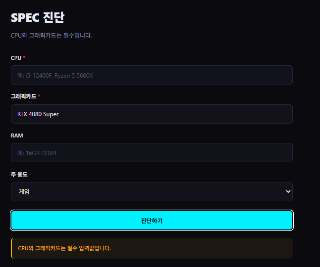
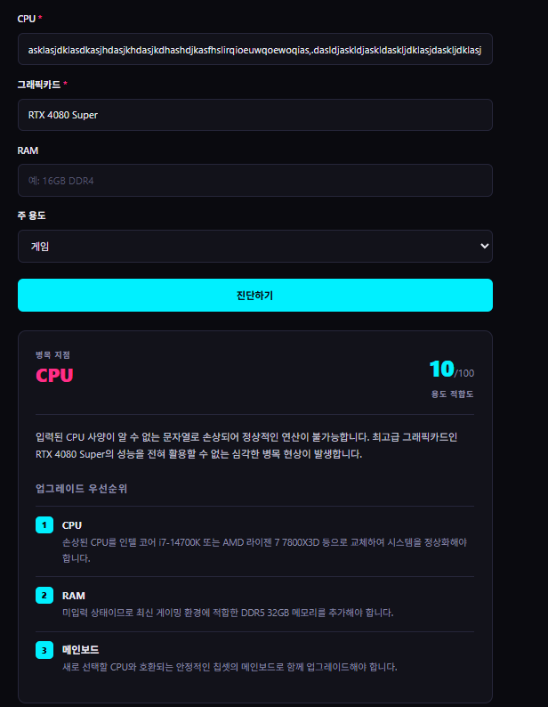

# BOTTLENECK 서비스 기획서

## 1. 서비스 개요

| 항목 | 내용 |
| --- | --- |
| 서비스명 | BOTTLENECK |
| 한 줄 소개 | CPU와 그래픽카드 조합의 병목 지점을 AI가 진단하는 웹 서비스 |
| 배포 URL | https://a1-3-orpin.vercel.app |
| 저장소 | https://github.com/6minho/A1-3 |

### 기획 배경

조립 PC를 맞추거나 부품을 업그레이드할 때 가장 흔한 실수는 **한 부품에만 예산을 몰아주는 것**이다.
고성능 그래픽카드를 샀는데 CPU가 따라가지 못하면 그래픽카드는 제 성능을 내지 못한다.
이를 병목(bottleneck) 현상이라 부르는데, 입문자는 자신의 조합에 병목이 있는지 판단하기 어렵다.

기존 병목 계산기 사이트들은 부품을 목록에서 골라야 하고 결과가 백분율 숫자 하나로만 나와서,
"그래서 뭘 바꿔야 하는가"에 대한 답을 주지 못한다.
BOTTLENECK은 **자연어로 사양을 입력받아, 판정 이유와 업그레이드 우선순위를 함께 제시하는 것**을 목표로 한다.

### 타겟 사용자

- 조립 PC를 처음 맞추면서 부품 조합이 적절한지 확인하고 싶은 입문자
- 기존 PC에서 특정 부품만 업그레이드하려는데 어디부터 손대야 할지 모르는 사용자
- 중고 부품 구매 전 현재 시스템과의 궁합을 확인하려는 사용자

### 제공 가치

1. 부품명을 자유 입력으로 받아 목록에서 찾는 번거로움을 없앤다.
2. 병목 부품을 지목하는 데 그치지 않고 **판정 근거를 문장으로 설명**한다.
3. 업그레이드 우선순위를 3개로 압축해 다음 행동을 명확히 제시한다.

---

## 2. 페이지 및 섹션 구성

단일 페이지 내 3개 섹션 구조를 채택했다.
앵커 링크(`#`) 기반 이동을 사용하며, 상단 네비게이션 바는 스크롤 시에도 고정된다.

| 순서 | 섹션 ID | 명칭 | 역할 |
| --- | --- | --- | --- |
| 1 | `#home` | HOME | 서비스 소개 및 진단 유도 |
| 2 | `#diagnose` | 진단 | AI 기능 (입력 폼 + 결과 출력) |
| 3 | `#glossary` | 용어 | 병목·TDP·PCIe 레인·프레임 드랍 설명 |

### 단일 페이지를 선택한 이유

- 사용자의 목표가 "진단 결과 확인" 하나로 명확해 페이지 분리 시 이탈 지점만 늘어난다.
- 용어 사전을 별도 페이지로 두면 진단 결과를 보다가 이동해야 해 맥락이 끊긴다.
- 반응형 검증 대상이 하나로 줄어 품질 관리가 쉽다.

### 디자인 방향

어두운 배경에 시안(`#00f0ff`)과 마젠타(`#ff2e88`)를 포인트로 쓰는 사이버펑크 계열 톤을 적용했다.
PC 하드웨어라는 소재와 어울리고, 색상 역할을 아래와 같이 고정해 정보 위계를 만들었다.

| 색상 | 용도 |
| --- | --- |
| 시안 | 점수, 주요 버튼, 강조 링크 |
| 마젠타 | 병목 부품명, 필수 입력 표시 |
| 앰버(`#ffb020`) | 경고 및 실패 안내 메시지 |

### 반응형 대응

| 데스크톱 | 모바일 |
| --- | --- |
|  |  |

`640px`를 분기점으로 미디어 쿼리를 적용했다.
모바일에서는 히어로 문구의 강제 줄바꿈을 해제하고, 용어 사전 카드를 2열에서 1열로,
결과 카드의 병목 정보와 점수를 가로 배치에서 세로 배치로 전환한다.

---

## 3. AI 기능 설계

### 입력

| 필드 | 필수 | 형식 | 예시 |
| --- | --- | --- | --- |
| CPU | O | 자유 텍스트 | i5-12400F |
| 그래픽카드 | O | 자유 텍스트 | RTX 4080 Super |
| RAM | X | 자유 텍스트 | 16GB DDR4 |
| 주 용도 | X | 선택(5종) | 게임 / 영상 편집 / 3D 렌더링 / 사무·웹서핑 / 개발·코딩 |

선택 입력은 미입력 시 `"미입력"` 문자열로 대체해 프롬프트에 전달한다.
AI는 이를 인지하고 해당 항목에 대한 권장 사항을 업그레이드 목록에 포함시킨다.

### 출력

AI 응답은 아래 JSON 스키마로 고정한다.
프론트엔드는 이 구조를 파싱해 카드 UI로 렌더링한다.

```json
{
  "bottleneck": "병목 부품명",
  "reason": "판정 이유 2문장",
  "score": 65,
  "upgrades": [
    { "part": "부품명", "why": "이유 1문장" }
  ]
}
```

| 필드 | 화면 표시 위치 |
| --- | --- |
| `bottleneck` | 결과 카드 좌측 상단, 마젠타 강조 |
| `score` | 결과 카드 우측 상단, 시안 대형 숫자 |
| `reason` | 점수 아래 본문 |
| `upgrades` | 번호 배지가 붙은 목록 3개 |

### 자유 텍스트 대신 JSON을 택한 이유

AI 응답을 그대로 화면에 출력하면 매번 형식이 달라져 레이아웃이 무너진다.
JSON으로 받아 프론트에서 조립하면 응답 내용이 바뀌어도 화면 구조는 일정하게 유지된다.
Gemini API의 `responseMimeType: "application/json"` 옵션으로 형식을 강제했다.

---

## 4. 실패 처리 기준

요구사항은 1개 이상이나, 실제 운영 환경에서 발생 가능한 3가지를 모두 구현했다.

| 상황 | 감지 위치 | 사용자 안내 문구 | HTTP 상태 |
| --- | --- | --- | --- |
| 필수값 누락 | 프론트 + 백엔드 | CPU와 그래픽카드는 필수 입력값입니다. | 400 |
| API 오류 | 백엔드 | 요청이 많습니다. 잠시 후 다시 시도해주세요. | 429 |
| API 오류(기타) | 백엔드 | AI 서버 오류가 발생했습니다. 잠시 후 다시 시도해주세요. | 502 |
| 응답 지연 | 프론트(15초) + 백엔드(25초) | 응답이 지연되고 있습니다. 잠시 후 다시 시도해주세요. | 504 |
| 네트워크 단절 | 프론트 | 네트워크 연결을 확인해주세요. | - |

### 설계 원칙

**필수값 검증을 양쪽에 둔다.**
프론트 검증만으로는 개발자 도구나 직접 요청으로 우회할 수 있어 백엔드에도 동일 검증을 배치했다.
프론트 검증은 불필요한 API 호출을 줄여 무료 티어 할당량을 아끼는 역할을 겸한다.

**타임아웃은 프론트가 먼저 끊는다.**
백엔드 25초, 프론트 15초로 설정해 사용자가 먼저 안내를 받도록 했다.

**에러 원문을 사용자에게 노출하지 않는다.**
개발 중에는 디버깅을 위해 API 응답 원문을 반환했으나,
내부 구조나 사용 중인 모델명이 드러나면 공격 표면이 되므로 완료 후 제거했다.

**AI 응답을 `textContent`로 삽입한다.**
`innerHTML`을 쓰면 AI가 생성한 문자열에 스크립트 태그가 포함될 경우 XSS로 이어질 수 있다.

---

## 5. 테스트 케이스

| 구분 | 입력 | 기대 결과 | 실제 결과 |
| --- | --- | --- | --- |
| 정상 | i5-12400F / RTX 4080 Super / 게임 | 병목 판정 및 업그레이드 3개 출력 | CPU 병목, 65점, 업그레이드 3개 정상 출력 |
| 선택값 미입력 | RAM 공란 | 정상 응답 + RAM 권장 포함 | 업그레이드 2순위에 RAM 32GB 권장 포함 |
| 빈 입력 | CPU 공란 | 필수값 안내 메시지 | 경고 박스 표시, 결과 카드 숨김 |
| 긴 입력 | CPU 칸에 200자 이상 무의미 문자열 | 크래시 없이 응답 | "손상된 사양"으로 판정, 10점 반환 |

### 테스트 결과 화면

**정상 입력**


병목 부품을 CPU로 판정하고 업그레이드 3가지를 제시했다.
RAM을 입력하지 않았음에도 미입력 상태를 인지해 권장 사항 2순위에 포함시켰다.

**빈 입력**



CPU 칸을 비운 채 진단을 시도하면 API 호출 없이 프론트엔드에서 차단하고 안내 메시지를 표시한다.
결과 카드는 숨김 처리되어 이전 결과가 남지 않는다.

**긴 입력**



200자 이상의 무의미한 문자열을 입력했을 때 크래시 없이 응답했으며,
AI가 "손상된 사양"으로 판단해 최저 점수(10점)를 반환했다.
예상하지 못한 입력에도 서비스가 중단되지 않고 판단 근거를 설명한다는 점을 확인했다.

---

## 6. 기술 스택

| 구분 | 사용 기술 | 선택 이유 |
| --- | --- | --- |
| 프론트엔드 | HTML / CSS / JavaScript (바닐라) | 과제 요구사항, 프레임워크 없이 동작 흐름 파악 |
| 백엔드 | Vercel Serverless Functions (Python) | 서버 관리 없이 API 키를 서버 측에 은닉 |
| AI | Google Gemini API (`gemini-3.5-flash-lite`) | 무료 티어 제공, 신용카드 등록 불필요 |
| HTTP 클라이언트 | requests | 요청·응답 흐름이 코드에 직접 드러남 |
| 배포 | Vercel + GitHub 연동 | push 시 자동 재배포 |

### 모델 선택 과정

초기에는 `gemini-2.5-flash`를 사용하려 했으나 신규 사용자 대상 지원이 종료되어 404가 반환됐다.
`gemini-3.5-flash`로 교체 후 정상 동작했으나 무료 티어 분당 요청 한도(429)에 자주 걸려,
한도가 더 여유로운 `gemini-3.5-flash-lite`로 최종 확정했다.
병목 진단은 긴 추론이 필요한 작업이 아니어서 경량 모델로도 결과 품질에 차이가 없었다.

상세 과정은 [AI 코딩 도구 사용 로그](ai-log.md)에 기록했다.

---

## 7. 보안 고려사항

**API 키는 코드에 포함하지 않는다.**
Vercel 환경 변수 `GEMINI_API_KEY`로 관리하며, 백엔드에서 `os.environ.get()`으로 읽는다.
프론트엔드는 키를 전혀 알지 못하고 `/api/diagnose`만 호출하므로 브라우저에 키가 노출되지 않는다.

**작업 환경은 공용 PC였다.**
키를 로컬 파일로 저장하지 않고 발급 직후 Vercel 환경 변수에 직접 등록했으며,
`.env`, `.env.local`, `.vercel`을 `.gitignore`에 사전 등록해 커밋 유입을 차단했다.

**키 유출 시 대응 절차**

1. Google AI Studio에서 해당 키 즉시 삭제
2. 새 키 발급 후 Vercel 환경 변수 교체
3. 커밋 이력에 포함됐다면 `git filter-repo` 등으로 히스토리 정리 후 강제 푸시
   (단, 이미 공개된 키는 히스토리를 지워도 유출된 것으로 간주하고 반드시 폐기)
